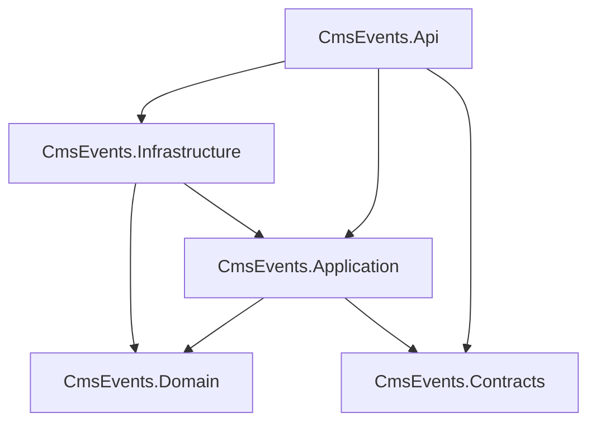
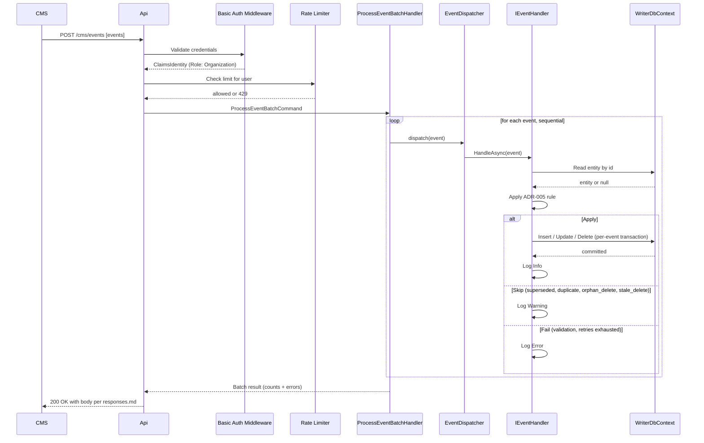
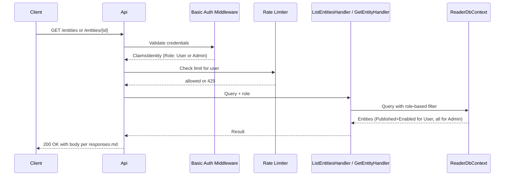
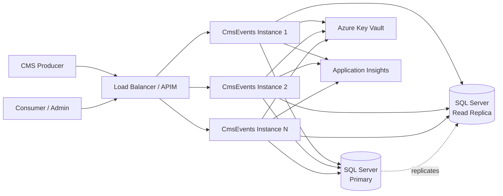

# Architecture — CmsEvents Service

**Project**: CmsEvents Service
**Last updated**: August 2026

## About this document

This document describes structural and operational aspects of the CmsEvents Service that support and complement the decisions in `decisions.md`. It is a reference for developers and operators, not a decision log — for the "why" behind design choices, consult the ADRs.

Companion documents:

- `decisions.md` — ADR-001 through ADR-016.
- `responses.md` — API response schemas with examples.
- `future-improvements.md` — deferred design ideas.
- `runbook-secret-rotation.md` — operational procedure for 90-day secret rotation.

## Contents

1. Solution structure
2. Entity state model
3. Architectural boundaries
4. Transport-agnostic handlers
5. Event processing flow
6. Deployment and scaling characteristics
7. Logging schema
8. Operational concerns

---

## 1. Solution structure

Five production projects plus three test projects, organized per ADR-001 (Clean Architecture) and ADR-016 (Testing Strategy):

```
CmsEvents/
├── src/
│   ├── CmsEvents.Api/            HTTP surface, auth middleware, DI composition root
│   ├── CmsEvents.Application/    Use cases (MediatR handlers), validation
│   ├── CmsEvents.Domain/         Entities, value objects, domain interfaces
│   ├── CmsEvents.Infrastructure/ EF Core, secrets, clock, external adapters
│   └── CmsEvents.Contracts/      Public DTOs (request/response shapes)
└── tests/
    ├── CmsEvents.Unit.Tests/
    ├── CmsEvents.Integration.Tests/
    └── CmsEvents.Architecture.Tests/
```

### Project dependencies

Enforced by ADR-002 boundary tests.



Domain depends on nothing beyond `System.*`. Api is the composition root — it wires Application handlers with Infrastructure adapters via DI. Infrastructure references Application to implement the repository ports defined there (dependency inversion per ADR-010).

---

## 2. Entity state model

Two orthogonal state axes on every entity, each governed by a distinct actor. See ADR-005 (idempotency) and ADR-007 (admin flag).

| Field | Type | Owner | Description |
|-------|------|-------|-------------|
| `Id` | string | CMS webhook | Primary key; matches CMS event `id` |
| `Status` | enum `{Published, Unpublished}` | CMS webhook | Set by CMS `publish` / `unPublish` events per ADR-005 |
| `IsDisabled` | boolean | Admin API | Local override; unaffected by CMS events per ADR-007 |
| `LastProcessedVersion` | integer | CMS webhook | Highest version applied per ADR-005 rule |
| `LastProcessedTimestamp` | DateTime UTC | CMS webhook | Tie-breaker for same-version events |
| `Payload` | JSON (`nvarchar(max)`) | CMS webhook | Opaque body from CMS event |
| `CreatedAt` | DateTime UTC | System | First insertion timestamp |
| `UpdatedAt` | DateTime UTC | System | Last modification timestamp |

### Visibility matrix

| Status | IsDisabled | Normal user | Admin |
|--------|-----------|-------------|-------|
| Published | false | Visible | Visible |
| Published | true | Hidden | Visible |
| Unpublished | false | Hidden | Visible |
| Unpublished | true | Hidden | Visible |

Delete events remove the row entirely (hard-delete per spec item 2). No tombstone.

### Persistence details

- Primary key: `Id` (string, matches CMS event `id`).
- Composite index: `(Status, IsDisabled)` — covers the normal user query per ADR-010.
- `Payload` stored as `nvarchar(max)` with `ISJSON` check constraint (SQL Server).
- `LastProcessedTimestamp` stored with millisecond precision (per ADR-005 tie-breaking assumption).

---

## 3. Architectural boundaries

Boundary rules from ADR-001, enforced by NetArchTest per ADR-002. All rules produce build failures if violated.

### Rules

1. **Domain isolation**: Types in `CmsEvents.Domain` must not depend on any namespace outside `System.*`. Rationale: keep enterprise business rules free from framework and infrastructure concerns.
2. **Application inward-only**: Types in `CmsEvents.Application` must not depend on `CmsEvents.Api` or `CmsEvents.Infrastructure`. Rationale: preserve dependency direction.
3. **Transport-agnostic Application**: Types in `CmsEvents.Application` must not depend on `Microsoft.AspNetCore.Http`, `Microsoft.AspNetCore.Mvc`, or `Microsoft.AspNetCore.Routing`. Rationale: preserves the extension paths in ADR-009 (async processing, streaming ingestion). See § Transport-Agnostic Handlers.
4. **Infrastructure boundary**: Types in `CmsEvents.Infrastructure` must not depend on `CmsEvents.Api`. Infrastructure **may** depend on `CmsEvents.Application` — adapters implement repository ports defined in Application (dependency inversion per ADR-010).
5. **MediatR handler placement**: Any type implementing `IRequestHandler<,>` or `IRequestHandler<>` must reside in `CmsEvents.Application`. Rationale: use cases are Application-layer citizens.
6. **Contracts sealed unless justified**: Public types in `CmsEvents.Contracts` should be sealed. Rationale: external consumers should not inherit from wire-format DTOs (breaking changes on internal refactors).
7. **ORM-agnostic Application**: Types in `CmsEvents.Application` must not depend on `Microsoft.EntityFrameworkCore`. Persistence details are hidden behind the repository interfaces (`IEntityRepository`, `IEntityQueries`, `IUserQueries`) per ADR-010. Rationale: preserves the ability to swap ORMs (EF → Dapper) or storage engines (SQL → NoSQL) with implementation-only changes.

### Interpretation notes

A "dependency" in NetArchTest is an IL-level type reference. Transitive dependencies (e.g., a NuGet package that transitively pulls `Microsoft.AspNetCore.Http` without using it) can produce false positives; rule 3 mitigates by targeting specific sub-namespaces rather than the broad `Microsoft.AspNetCore.*`.

---

## 4. Transport-agnostic handlers

**Design principle**: Application-layer handlers must be invokable from any transport (HTTP, message queue, background job) without modification. This preserves the extension paths in ADR-009 (async processing, Kafka ingestion) without refactor.

**Enforcement**: NetArchTest rule 3 (see § Architectural Boundaries) blocks direct references to `Microsoft.AspNetCore.Http`, `Microsoft.AspNetCore.Mvc`, `Microsoft.AspNetCore.Routing` from the Application assembly.

### Common temptations and correct patterns

| You want to... | Don't | Do |
|----------------|-------|-----|
| Read a request header inside a handler | Inject `IHttpContextAccessor`, read `HttpContext.Request.Headers` | Extract the header in the controller/endpoint and pass it as a property of the command/query |
| Get the current authenticated user | Read `HttpContext.User` from `IHttpContextAccessor` | Inject `ICurrentUserService` (interface in Application, implementation in Api using `IHttpContextAccessor`) |
| Access the correlation ID | Read from `HttpContext.TraceIdentifier` | Inject `ICorrelationContext` (interface in Application, implementation resolves from HTTP or message envelope depending on entry point) |
| Check dynamic authorization | Inject `IAuthorizationService` | Inject `IAuthorizationChecker` abstraction, or perform check in domain logic against a value passed by the caller |
| Return a rich error response | Return `ProblemDetails` from handler | Return `Result<T>` with structured error; translate to `ProblemDetails` in the API layer |
| Consume an uploaded file | Accept `IFormFile` parameter | Accept `Stream` + metadata, or a custom `IUploadedFile` abstraction |
| Handle request cancellation | Read `HttpContext.RequestAborted` | Accept `CancellationToken` parameter (MediatR already provides this) |
| Build a URL for a callback or link | Use `LinkGenerator` or `IUrlHelper` | Inject `IUrlBuilder` abstraction, implementation in Api uses `LinkGenerator` |

### Why the ceremony is worth it

- The same handler can be invoked from a `BackgroundService` reading a queue or a Kafka consumer without any code change.
- Handlers become trivially unit-testable — no `HttpContext` mocking, no in-memory `TestServer` needed.
- Boundary breaches surface at build time (via boundary tests) rather than as runtime coupling that only appears when we try to extract the handler for reuse.

### Legitimate exceptions

If a genuine need arises (a utility from `Microsoft.AspNetCore.WebUtilities` with no `System.*` equivalent, for example), evaluate case-by-case. Prefer alternatives from `System.*`. If truly necessary, document the exception in the affected file and note it in the next ADR revision.

---

## 5. Event processing flow

Sequence of operations for `POST /cms/events`.



Events are processed sequentially per ADR-008. Each event runs in its own DB transaction; failure on one does not roll back others.

### Query flow

`GET /entities` and `GET /entities/{id}` follow a shorter path:



Admin disable/enable endpoints follow the query pattern but use `WriterDbContext` for the update.

---

## 6. Deployment and scaling characteristics

The service is designed for horizontal scalability without code changes.

### Statelessness

- No in-memory session state per request.
- No per-instance caches that would diverge across replicas.
- Every request carries or synthesizes its own `correlationId` per ADR-014.
- Rate limiter state is per-instance per ADR-013; aggregate limit is `perInstance × instanceCount`.

### Idempotency

- Per ADR-005, retries of the same `publish` / `unPublish` event produce the same end state.
- Enables safe execution behind a load balancer without sticky sessions.
- CMS retries after a timeout (per ADR-009) are absorbed without corruption.
- Delete events have limited idempotency due to hard-delete semantics (see ADR-005 Consequences).

### Deployment topology (production)



### Auto-scale triggers

Out of scope for this codebase (hosting platform concern). Typical signals:

- CPU utilization > 70%.
- Request queue depth.
- HTTP 429 count per minute (if application-level rate limiting rejects a significant fraction, add capacity).

### HTTPS requirement

Basic Auth transmits credentials on every request per ADR-011. HTTPS is mandatory in production and enforced at the load balancer / APIM tier. Local dev uses `dotnet dev-certs` for `https://localhost:5001`.

### Read replica routing

`ReaderDbContext` connection string in production points to a read replica per ADR-010. Replication lag is acceptable — read handlers may see slightly stale data. If lag becomes a concern, tune replica configuration; no code change required.

### Multi-instance rate limiting note

The built-in ASP.NET Core rate limiter tracks state per instance. Behind N replicas, the effective aggregate limit for a single user is `perInstance × N`. Deferred to `future-improvements.md`: switching to a distributed store (Redis) if per-user precision across the cluster becomes a requirement.

---

## 7. Logging schema

Full field reference for structured logs produced by Serilog per ADR-014.

### Common fields (every log entry)

| Field | Type | Description |
|-------|------|-------------|
| `Timestamp` | ISO 8601 UTC | Log emission time |
| `Level` | string | `Debug`, `Info`, `Warning`, `Error` |
| `Message` | string | Template-rendered message |
| `MessageTemplate` | string | Raw Serilog template |
| `Environment` | string | `Development`, `Staging`, `Production` |
| `MachineName` | string | Host machine identifier |
| `AssemblyVersion` | string | Service version |
| `CorrelationId` | GUID string | Per-request identifier (see ADR-014) |
| `RequestPath` | string | HTTP path when in request scope |
| `Exception` | object | Structured exception when present |

### Batch processing fields (during `POST /cms/events`)

| Field | Type | Description |
|-------|------|-------------|
| `BatchId` | GUID string | Per-batch identifier |
| `EventIndex` | integer | 0-based index of event in batch |
| `EventId` | string | Event identifier (from payload or generated) |
| `EntityId` | string | Entity `id` from event |
| `Type` | string | `publish`, `unPublish`, or `delete` |
| `Version` | integer | Event version (null for `delete`) |
| `Outcome` | string | `processed`, `skipped`, or `failed` |
| `Reason` | string | Skip or failure reason enum (see responses.md) |
| `DurationMs` | integer | Handler execution time in ms |

### Log level assignments

| Level | Emitted for |
|-------|-------------|
| `Debug` | Idempotency comparisons (disabled in production) |
| `Info` | Event applied, batch completed, request received |
| `Warning` | Skipped events (`superseded_by_version`, `duplicate`, `orphan_delete`, `stale_delete`), clock-skew events per ADR-005, 4xx responses, 429 rate limit rejections |
| `Error` | Permanent failures, 5xx responses, transient failure retry exhaustion with internal cause (e.g., "DB deadlock persisted after 3 retries") |

### Privacy and cost

- Full inbound payloads are never logged (opaque per spec; potentially sensitive; ingest cost). Log the summary (event type + count) and retrieve payloads from the DB by `EntityId` if support requires.
- Application Insights adaptive sampling is enabled in production per ADR-014 — errors retained, high-volume info sampled.

---

## 8. Operational concerns

### Secret rotation

90-day rotation cadence for all secrets per ADR-012. Full procedure in `runbook-secret-rotation.md`.

### Payload retrieval for support

Producers reporting an issue reference `batchId` and `correlationId` from the response. To trace an event server-side:

1. Query Application Insights with the `correlationId` filter for the full request trace.
2. If the event was applied, the persisted entity is retrievable from the DB by `EntityId`.
3. If the event was skipped, the log entry contains the reason and full context (no separate DB record).
4. If the event failed, the log entry (at Error level for transient exhaustion, or Warning for validation) contains the internal cause.

Persisting full inbound batches as a separate audit table is an option deferred to `future-improvements.md` (privacy and cost trade-offs to evaluate).

### Time source

Domain code that requires the current time depends on `IClock` (interface in Domain, implementation `SystemClock` in Infrastructure). This enables deterministic tests and future support for time-shift operations if required.

### Migrations

EF Core migrations owned by `WriterDbContext` per ADR-010. Migration commands:

```bash
dotnet ef migrations add <Name> \
  --project src/CmsEvents.Infrastructure \
  --startup-project src/CmsEvents.Api \
  --context WriterDbContext

dotnet ef database update \
  --project src/CmsEvents.Infrastructure \
  --startup-project src/CmsEvents.Api \
  --context WriterDbContext
```

`ReaderDbContext` is not used for migrations. `ApplicationIntent=ReadOnly` in the reader connection string prevents accidental DDL.

### Seed data

The `Users` table (per ADR-011) is seeded at startup with three users (`cms-webhook-user`, `readonly-user`, `admin-user`) from configuration. `UserSeeder.SeedAsync` runs at every startup and is idempotent — it inserts any user that is missing from the table and updates the password hash for any user whose configured hash has drifted from what's stored (so rotating a hash in User Secrets or Key Vault propagates on the next restart without a manual DB step). Passwords are BCrypt-hashed values sourced from User Secrets (local dev) or Azure Key Vault (production).

### Docker

The service ships with a `docker-compose.yml` for local development that starts:

- CmsEvents.Api container.
- SQL Server 2022 container (mirrors production DB engine).
- Optional: Azurite for future Blob/Queue emulation if needed.

Production deployment uses the same Dockerfile; the compose file is for local convenience only.
